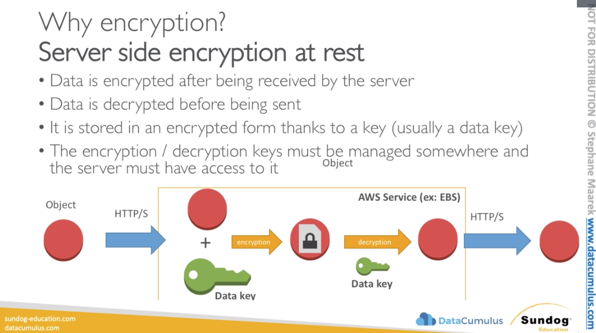
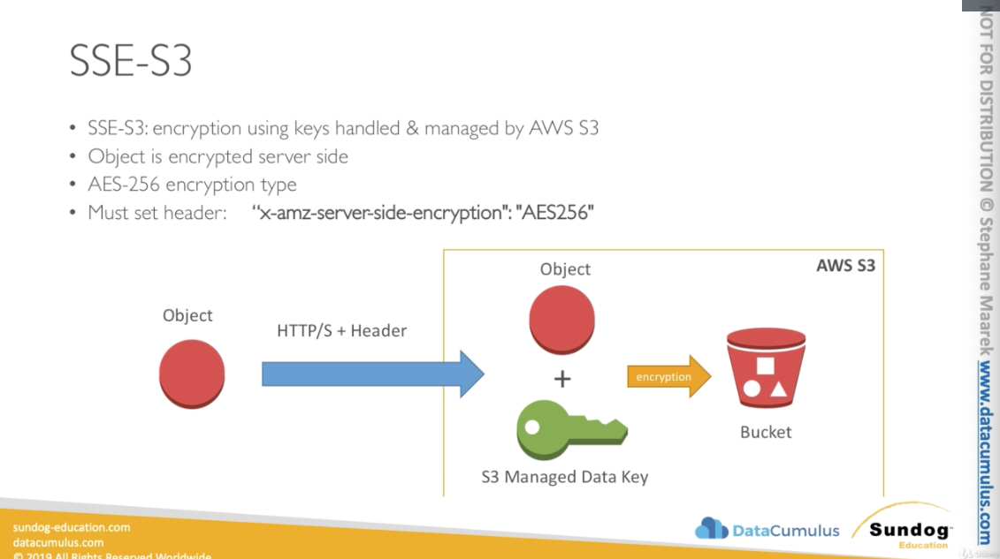
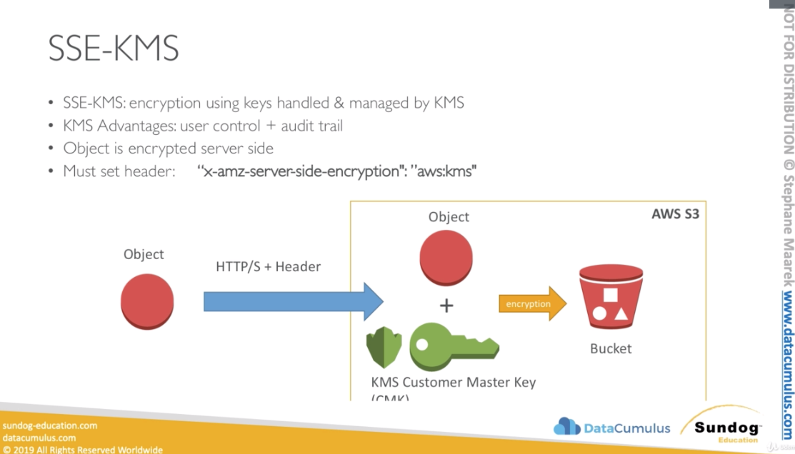
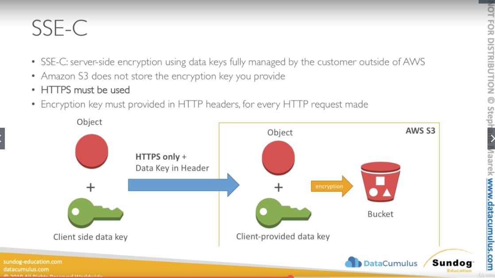
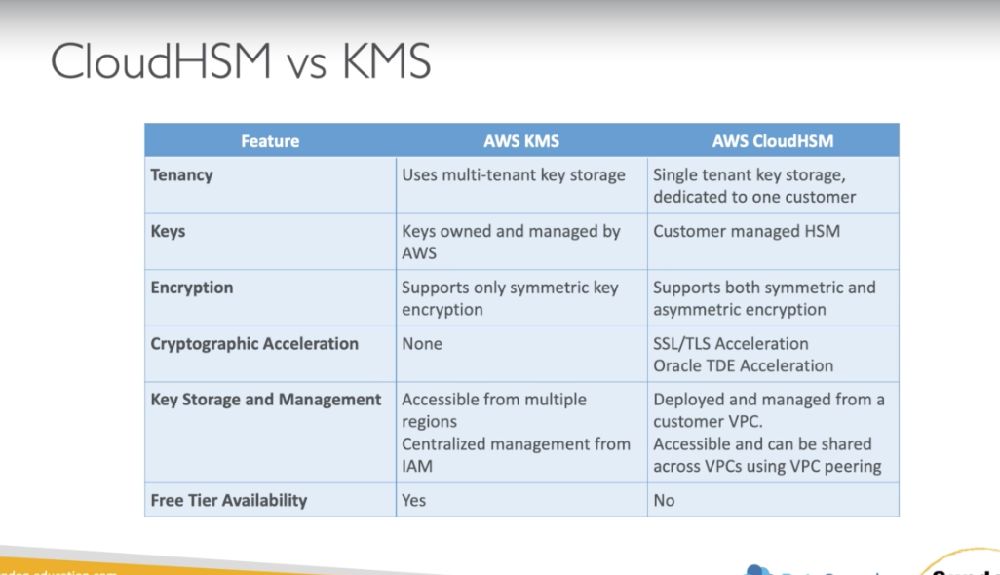

# AWS Security & Encryption
* KMS, Encryption SDK, SSM Parameter Store


### Why encryption?
#### Encryption in flight (SSL)
* When I send very sensitive information e.g. credit card to a server to make a
  payment online, I want to make sure that no one where my packet is going to
  travel no one can see my credit card number.
* Data is ecrypted before sending and decrypted after receiving (only me and
  server knows how to do this things)
* SSL certificates help with encryption (HTTPS)
* Anytime we are dealing with an AWS service and it has an HTTPS endpoint that
  guarantee us that there is encryption in flight.
* Encryption in flight ensures no MITM (man in the middle attack)
* Only a server knows how to decrypt the information received from a client. A
  client encrypts the information that it wants to send.


#### Server side encryption at rest
* Data is encrypted after being received by the server 
* The server stores the data on its disk and encrypts the data
* Data is decrypted before being sent back to our client
* It is stored in an ecnrypted form, thanks to a key (usually a data key)
* The encryption / decryption keys must be managed somewhere and the server must
  have access to it. Usually it's called a KMS (Key Management Service). A
  server must **have the right** to talk to that KMS.



#### Client Side Encryption
* Data is encrypted by the client (us) and never decrypted by the server
* Server stores the data but don't know what the data is
* Data will be decrypted by a receiving client
* The server should not be able to decrypt the data
* Could leverage Envelope Encryption


#### S3 Encryption for Object
* There are 4 methods of encrypting objects in S3
  * SSE-S3: encrypts S3 objects using keys handled & managed by AWS
  * SSE-KMS: leverage AWS Key Management Service to manage encryption keys
  * SSE-C: when you want to manage your own encryption keys
  * Client Side Encryption

#### SSE-S3
* SSE-S3. encryption using keys handled & managed by AWS S3
* Object is encrypted server side
* AES-256 encryption type
* Must set header: "x-amz-server-side-encryption": "AES256"
  * With this header we request Amazon to perform server-side encryption for us
    with the algorightm AES256
* We send data with a header to AWS S3
* AWS creates an S3 Managed Data Key
* The data gets encrypted
* The encrypted data get's stored in S3




#### SSE-KMS
* SSE-KMS: encryption using keys handleded & managed by KMS
* KMS Advantages: user control + audit trail
* Object is encrypted server side
* Must sset header: "x-amz-server-side-encryption": "aws:kms"
* The data gets send to AWS with a header
* Amazon takes a KMS Customer Master Key (CMK)
* Amazon encrypts the data 
* Amazon stores the data in S3


#### SSE-C
* SSE-C: server-side encryption using data keys fully managed by the customer
  outside of AWS
* Amazon S3 does not store the encryption key you provide
* HTTPS must be used
* Encryption key must be provided in HTTP headers, for every HTTP request made 
* We have an object that we want to store in S3
* We generate client side data key
* Over HTTPS only we send the a data key in a header
* We put the object and the client provided data key
* Amazon S3 does the encryption between the object and the client provided data
  key
* The object is encrypted and stored into the bucket
* Amazon throws away the client provided data key



#### Client Side Encryption
* Client library such as the Amazon S3 Encryption Client
* **Clients must encrypt data themselves before sending to S3**
* Clients must decrypt data themselves when retrieving from S3
* Customer fully manages the keys and encryption cycle
* Using AWS S3 Encryption SDK we'll generate Client side data key
* All togher with the object we will encrypt that data client side
* The encrypted object will be transfered over to the bucket


#### Encryption in transit (SSL)
* AWS S3 exposes:
  * HTTP endpoint: non encrypted traffic
  * HTTPS endpont: encryption in flight (the data exchange between client and
    the server is encrypted in flight)
  * You're free to use the endpoint you want, but HTTPS is recommended
* HTTPS is mandatory for SSE-C
* Encryption in flight is also called SSL / TLS in the exam

* SSE-C & Client Side Encryption is not possible to do form UI. But we can do it
  programmatically

### AWS KMS (Key Management Service)
* Anytime you hear "encryption" for an AWS serivce, it's most likely KMS
* Easy way to control access to your data, AWS manages encryption keys for us
* Fully integrated with IAM for authorization
* Semlessly integrated into:
  * Amazon EBS: encrypt volumes
  * Amazon S3: Server side encryption
  * Amazon Redshift: encryption of data
  * Amazon RDS: encrytion of data
  * Amazon SSM: Parameter store (you can encrypt secrets with KMS)
* But you can also use the CLI / SDK to leverage the KMS functionality

#### AWS KMS 101
* Anytime you need to share sensitive information... use KMS
  * Database passwords
  * Credentials to external services
  * Private Key of SSL certificate
* The value in KMS is that CMK (customer master key) used to encrypt data can
  never be retrieved by the user, and the CMK can be rotated for extra security.
* We don't manage the keys, AWS does it for us and we don't perform encryption
  by ourselves, AWS does it for us.
* Don't store plain secrents in your code / file. Use KMS for that.
* Encrypted secrets can be stored in the code / environment variables
* KMS can only help encrypting up to 4kb of data per call
* If data > 4KB, use envelope encryption (will generate a new data key and that
  data key will be used to encrypt big files)
* To give access to KMS to someone:
  * Make sure the Key Policy allows the user
  * Make sure the IAM Policy allows the API calls

#### AWS KMS
* Able to fully manage the keys & policies:
  * Create
  * Rotation policies
  * Disable
  * Enable
* Able to audit key usage (using CloudTrail)
* Three types of Customer Master Keys (CMK)
  * AWS managed service default CMK: free
  * User Keys created in KMS: 1$ / month
  * User Keys imported (must be 256-bit symmetric key): $1 / month
* + pay for API call to KMS ($.04 / 10000 calls) - anytime you are going to
    encrypt and decrypt data you'll be charged a fee
* Use case:
  * You have a client (cli / skd) and you have a password
  * You have the KMS service and you're going to use the Encrypt API
  * Within the KMS service is going to lookup the CMK you want to use
  * Is the user allowd to do this CMK encrypt call? (it looks at the IAM
    permissions - IAM policy)
  * If everything is ok, the encryption gets performed
  * The KMS will send you back the encrypted secret (we never touch the CMK, we
    just send something and receive back the secret)
  * We're going to store that encrypted secret
  * Later on our application needs to decrypt that secret. We are going to use
    the CLI / SDK to issue a Decrypt API call.
  * Using the same CMK the KMS service is going to check the IAM permissions and
    make sure we have do decrypt access and look at the key policy
  * Decryption will happen and will get a decrypted secret back in a plain text.


#### Encrypton in AWS Services
* Requires migration (through Snapshot / Backup). First backup and then create
  an encrypted volume
  * EBS Volumes 
  * RDS databases
  * ElastiCache
  * EFS network file system
* In-place encrytpion: (if you have an un-encrypted file and want to encrypt it
  right away, you can use KMS only for S3)
  * S3

### Cloud HSM
* The alternative of using KMS is to have your own Hardware module called Cloud
  HSM
* KMS => AWS manages the software for encryption
* CloudHSM => AWS will provision the encryption hardware but the software is
  managed by the company. And it's up to us to encrypt and decrypt.
* Dedicated Hardware (HSM = Hardware Security Module)
* You manage your own encryption keys entirely (not AWS)
* The CloudHSM hardware device is tamper resistant
* FIPS 140-2 Level 3 complience (does allow you to be complient with some
  regulations in some industries)
* CloudHSM clusters are spread across multi AZ (HA)
* Supports both symmetric and assymmetric encryption (SSL/TLS keys)
* No free tier available
* Must use the CloudHSM Client Software (it's not that easy that you make CLI or
  SDK call)
* In the exam: If we need to have the dedicated encryption hardware or we need
  to have control over the user keys and still be in the AWS cloud or have
  assymetric type of encryption CloudHSM is the answer





### Security - Kinesis
* Kinesis Data Streams:
  * SSL endpoints using the HTTPS protocol to do encryption in flight
  * AWS KMS provides server-side encryption [Encryption at rest]
  * For client-side encrypton, you must use your own encryption libraries
  * Supported Interface VPC Endpoints / Private Link - acess privately
  * KCL - must get read / write access to DynamoDB table for checkpointing
* Kinesis Data Firehose:
  * Attach IAM roles so it can deliver to S3 / ES / Redshift / Splunk
  * Can encrypt the delivery stream with KMS [Server side encryption]
  * Supported Interface VPC Endpoints / Private Link - access privately
* Kinesis Data Analytics
  * Attach IAM role so it can read from Kinesis Data Streams and reference
    sources and write to an output destination (example Kinesis Data Firehose)

### Security - SQS
* Enryption in flight using the HTTPS endpoint
* Server Side Encryption using KMS
* IAM policy must allow usage of SQS
* SQS queue access policy, similar to the S3 bucket policy. You can define a
  policy on the resource itself, who is able to access the SQS.
    * IAM policies specify what actions are allowed or denied on what AWS resources. IAM policies can be attached to IAM users, groups, or roles, which are then subject to the permissions defined in the policy. In other words, IAM policies define what a principal can do in AWS resources.
    * S3 bucket policies only control access to S3 resources, whereas IAM policies can specify nearly any AWS resources. In AWS you can apply both IAM policies and S3 bucket policies simultaneously, to authorize least-privilege of the permissions.
    * S3 bucket policies are attached only to S3 buckets. S3 bucket policies specify what actions are allowed or denied for which principals on the bucket that bucket policy is attached to. S3 bucket policies can be attached at bucket level, but the permissions specified in the bucket policy apply to all the objects in the bucket.
* Client-side encryption must be implemented manually
* VPC Endpoint is provided through an interface

### Security - AWS IoT
* AWS IoT policies:
  * Attach to X.509 certificate or Cognito Identities
  * Able to revoke any device at any time
  * IoT Policies are JSON documents
  * Can be attached to groups instead of individual Things.
* IAM Policies
  * Attached to users, group or roles
  * Used for controlling IoT AWS APIs
* Attach roles to Rules Engine so they can perform their actions

### Security - Amazon S3
* IAM policies
* S3 bucket policies
* Access Control Lists (ACLs)
* Encryption in flight using HTTPS
* Encryption at rest:
  * Server-side encryption: SSE-S3, SSE-KMS, SSE-C
  * Client-side encryption: - such as Amazon S3 Encryption Client
* Versioning + MFA Delete
* CORS for protecting websites
* VPC Endpoint is provided through a Gateway
* Glacier - vault lock policies to prevent deletes (WORM - write ones, read many)

### Security - DynamoDB
* Data is encrypted in transit using TLS (HTTPS)
* DynamoDB can be encrypted at rest
  * KMS encryption for base tables and secondary tables
  * Only for new tables
  * To migrate un-encrypted table, create a new table and copy the data
  * Encryption cannot be disabled once enabled
* Access to tables / API / DAX using IAM
* DynamoDB Streams do not support encryption
* VPC Endpoint is provided through a Gateway (so your private instances can
  access DynamoDB directly)

### Security - RDS
* RDS will be deployed within your VPC and that provides network isolation
* Security Group control network access to DB Instances
* KMS provides encryption at rest
* SSL provides encryption in-flight
* IAM policies don't provide protection within the DB, they provide protection
  for the RDS API
* IAM authentication is supported by PostgreSQL and MySQL
* Must manage user permissions within the database itself
* MSSQL Server and Oracle support TDE (Transparent Data Encryption) on top of
  KMS

### Security - Aurora
* very similar to RDS
* VPC provides network isolation
* Security Groups control network access to DB Instances
* KMS provides encryption at rest
* SSL provides encryption in-flight
* IAM authentication is supported by PostgreSQL and MySQL
* Must manage user permissions within the database itself

### Security - Lambda
* IAM roles attached to each Lambda function
  * Sources
  * Targets
* KMS encryption for secrets
* SSM parameter store for configuration
* CloudWatch Logs
* You can deploy your Lambda into a VPC in case you need access to resources
  within your VPC

### Security - Glue
* IAM policies for the Glue service
* Configure Glue to only access JDBC through SSL
* Data Catalog can be encrypted by KMS
* Connection passwords: Encrypted by KMS (when Glue wants to access your
  database, you can encrypt the keys)
* Data written by AWS Glue - Security Configurations:
  * S3 encryption mode: SSE-S3 or SSE-KMS
  * CloudWatch encryption mode
  * Job bookmark encryption mode

### Security - EMR
* Using Amazon EC2 key pair for SSH credentials
* Attach IAM roles to EC2 instances for:
  * proper S3 access
  * for EMRFS request to S3
  * DynamoDB scans through Hive
* EC2 Security Groups for the instances
  * One for the master node
  * Another one for cluster node (core node or task node)
* Encrypts data at-rest: EBS encryption, Open Source HDFS Encryption, LUKS +
  EMRFS for S3
* In-transit when nodes needs to communicate with each other to do Spark or
  MapReduce jobs, you can use in-transit encryption using SSL ceritificates, EMRFS, TLS
* Data is encrypted before uploading to S3 by EMR
* Kerberos authentication (provide authentication from Active Directory)
* Apache Ranger: Centralized Authorization (RBAC - Role Based Access) - setup on
  external EC2 

[Best practices for securing aws
emr](https://aws.amazon.com/blogs/big-data/best-practices-for-securing-amazon-emr/)

### Security - ElasticSearch Service
* Deploy within a VPC will provide network isolation
* ElasticSearch policy to manage security futher
* Data security by encrypting data at-rest using KMS
* Encryption in-transit using SSL

* IAM or Cognito based authentication (log in to Kibana using Cognito)
* AWS Cognito allow end-users to log-in to Kibana through enterprise identity
  providers such as Microsoft Active Directory using SAML


### Security - Redshift
* VPC provides network isolation
* Cluster security groups
* Encryption in flight using the JDBC driver enabled with SSL
* Encryption at rest using KMS or an HSM device (establish a connection)
* Supports S3 SSE using default managed key
* Use IAM Roles for Redshift
  * To access other AWS Resources (example S3 or KMS)
  * Must be referenced in the COPY and UNLOAD command you can use IAM roles or
  directly paste access key and secret key creds into your SQL statements

### Security - Athena
* IAM policies to control access to the service
* Data is in S3: IAM policies, butcket policies & ACLs
* Encryption of data accroding to S3 standards: SSE-S3, SSE-KMS, CSE-KMS
* Encryption in transit using TLS between Athena and S3 and JDBC
* Fine grained access using the AWS Glue Catalog

### Security Quicksight
* Standard edition:
  * IAM users
  * Email based accounts
* Enterprise edition:
  * Active Directory
  * Federated Login
  * Supports MFA 
  * Encryption at rest and in SPICE
* Row Level Security to control which users can see which rows

### AWS STS - Security Token Service
* Allows to grant limited and temporary access to AWS resources
* Token is valid for up to one hours (must be refreshed)
* Cross Account Access
  * Allows users from one AWS account access resources in another
* Federation (Active Directory)
  * Provides a non-AWS user with temporary AWS access by linking users Active
    Directory credentials
  * Uses SAML (Security Assertion markup language)
  * Allows Single Sign On (SSO) which enables users to log in to AWS console
    without assigning IAM credentials
* Federation with third party providers / Cognito
  * used mainly in web and mobile applications
  * Makes use of Facebook/Google/Amazon etc. to federate them

### Cross Account Access
* Define an IAM Role for another account to access
* Define which accounts can access this IAM Role
* Use AWS STS (Security Token Service) to retrieve credentials and impersonate
  the IAM Role you have access to (AssumeRole API)
* Temporary credentatils can be valid between 15 minutes to 1 hour
* User wants to assume Role (sam or other account)
* Makes an AssumeRole API call to AWS STS
* AWS STS checks if user is allowed to do that IAM permissions via trusted entity
* If allowed, AWS STS will send you back temporary security credentials
* This security credentials will allow you to assume the role you need to


### Identity Federation
* Users outside of our organisation don't need an account at AWS to access
  resources on AWS
* Federation lets users outside of AWS to assume temporary role for accessing
  AWS resources
* These users assume identity provides access role.
* Use case:
  * We are an user e.g. of a mobile app and we don't have account at AWS
  * But we do have 3rd party access to servers to log in e.g. our own servers,
    cognito, facebook, google
  * This 3rd party is trusted by AWS. We have defined before hand trust between
    3rd party and AWS. 
  * Users will login to the 3rd party (assume they are checking all the infos)
    and the 3rd party will give back credentials to a user.
  * As a user we can directly access AWS through the CLI or API.  
* This is how the identity federation works. The identity is stored on the third
  party.
* Federation assumes a from of 3rd party authentication:
  * LDAP
  * Microsoft Active Directory (~=SAML)
  * Single Sign On
  * Open ID
  * Cognito
* Using federation, you don't need to create IAM users (user management is
  outside of AWS)

#### SAML Federation
* To integrate Active Directory / ADFS with AWS (or only SAML 2.0)
* Provides access to AWS Console or CLI (through temporary creds)
* No need to create an IAM user for each of your employees

1. We are a client app and do connect to idP (which is SAML complient / it could
   be Microsoft Active directory)
2. It will authenticate the user based on the user database
3. When we're authenticated idP will send us a SAML assertion (it's a token)
4. When we'll get the SAML assertion we'll do call STS assumeRoleWithSaml API.
   STS checks the SAML assertion (token)
5. STS will give us back temporary security credentials 
6. Now with the temporary security credentials we cann access resources at AWS


#### Custom Identity Broker Application
* Use only if identity provider is not compatible with SAML 2.0
* You have to program the identity broker must determine the appropriate IAM
  policy
* Identity broker will validate our identity with a corporate identity store.
* If it's happy, the identity broker has super powers and it can ask from STS
  any security credentials for any policy. 


#### AWS Cognito - federated Identity Pools For Public Application (for apps)
* E.g. a user need to put a file into S3 bucket
* Goal
  * Provide direct access to AWS Resources from the client side
* How:
  * Log into federated identity provder - or remian anonmyous
  * Get temporary AWS credentials back from the Federated Identity Pool
  * These credentials come with a pre-defined IAM policy stating their
    permissions
* Example:
  * provide (temporary) access to write to S3 bucket using Facebook login
* How does it work?
  1. We have an app and our app is connected to identity provider: Cognito User
    Pool, Google, Facebook, Twitter, SAML, OpenID
  2. Our app logs into to the identity provider and gets a token back from
     identity provider
  3. The app talks to the federated identity in Cognito 
  4. The token will be verified by the federated identity provider (Cognito,
     Google, Facebook)
  5. The federated identity will get credentials from STS
  6. The federated identity will send us back temporary AWS credentials
  7. Now using this credentials we can talk to S3 bucket and make some calls


#### Policies - leveraging AWS variables
* ${aws:username}: to restrict users to tables / buckets (check if some specific
  username can get the policy or is allowed to do specific operations)
* ${aws:principaltype}: account, user, federated, or assumed role (check if only
  specific pricipaltype can get the policy or is allowed to do specific
  operations)
* ${aws:PrincipaTag/department}: to restinct using Tags (if the principal tag
  === department)

[Source](https://docs.aws.amazon.com/IAM/latest/UserGuide/reference_policies_variables.html)

```
{
  "Version": "2012-10-17",
  "Statement": [
    {
      "Action": ["s3:ListBucket"],
      "Effect": "Allow",
      "Resource": ["arn:aws:s3:::mybucket"],
      "Condition": {"StringLike": {"s3:prefix": ["David/*"]}}
    },
    {
      "Action": [
        "s3:GetObject",
        "s3:PutObject"
      ],
      "Effect": "Allow",
      "Resource": ["arn:aws:s3:::mybucket/David/*"]
    }
  ]
}
```
* The variables will be replaced at the runtime

```
{
  "Version": "2012-10-17",
  "Statement": [
    {
      "Action": ["s3:ListBucket"],
      "Effect": "Allow",
      "Resource": ["arn:aws:s3:::mybucket"],
      "Condition": {"StringLike": {"s3:prefix": ["${aws:username}/*"]}}
    },
    {
      "Action": [
        "s3:GetObject",
        "s3:PutObject"
      ],
      "Effect": "Allow",
      "Resource": ["arn:aws:s3:::mybucket/${aws:username}/*"]
    }
  ]
}
```

* ${aws:FederatedProvider}: which IdP was used for the user (Cognito, Amazon)
* ${www.amazon.com:user_id}, ${cognito-identity.amazonaws.com:sub}

```
{
  "Version": "2012-10-17",
  "Statement": {
    "Effect": "Allow",
    "Principal": "*",
    "Action": "s3:GetObject",
    "Resource": "arn:aws:s3:::BUCKET-NAME/${aws:FederatedProvider}/*"
  }
}
``` 
* In this example we have a bucket with a prefix for each federated provider
  (/amazon/, /facebook/, /google/)

[Source](https://docs.aws.amazon.com/IAM/latest/UserGuide/reference_policies_iam-condition-keys.html)

* S3 bucket policies:
  [Source](https://docs.aws.amazon.com/AmazonS3/latest/dev/example-bucket-policies.html)

* DynamoDB policies:
  [Source](https://docs.aws.amazon.com/amazondynamodb/latest/developerguide/specifying-conditions.html)

* Note RDS - IAM policies don't help with in-database security, as its a
  propertiary technology and we are reponsible for users & authorization


### CloudTrain
* Provides governance, complienace and audit for your AWS account
* It will track every API call that will be made to your account
* CloudTrail is enabled by default
* Get an history of events / API calls made within your AWS Account by:
  * Console
  * SDK
  * CLI
  * AWS Services
* Can put logs from CloudTrail into CloudWatch Logs
* If a resource is deleted in AWS, look into CloudTrail first!
* CloudTrail shows the past 90 days of activity
* The defalt UI only shows "Create", "Modify", or "Delete" evetns
* CloudTrail Trail:
  * Get a detailed list of all the events you choose
  * Ability to store these events in S3 for further analysis
* CloudTrail Logs have SSE-S3 encryption when placed into S3
* Control access to S3 using IAM, Bucket Policy, etc...

### VPC Endpoints
* Endpoints allow you to connect to AWS Service susing a private network instead
  of the public www network. With VPC endpoints you are able to connect your
  private network on AWS.
* They sxale horizontally and are redundant
* They remove the need of IGV, NAT, etc... to access AWS Services
* Gateway: provisions a target and must be used ina route table ONLY for S§ and
  DynamoDB
* Interface: provisions an ENI (private IP added) as an entry point (must attach
  security group) - most AWS services. Also called VPC PrivateLink
* Example:
  1. SQS is a public service and accessible on the www (world wide web)
  2. We want to access SQS from a private EC2 Instance
  3. You create a VPC Endpoint / PrivateLink, which has a private connection
     diretly into SQS service.
  4. To access SQS service EC2 instance will connect the VPC Endpoint /
     PrivateLink


* You would like to ensure data is encrypted client side before being sent to
  Kinesis. What should you use? You must create custom code
* Which technology allows you to access the AWS service from your private
  subnets without the need to have an outgoing internet connection? VPC Endpoint
* What do you need to attach to an IoT rule's engine action to ensure it's capable of sending data directly into Kinesis?
* Which of the following statement is wrong? Users must be created within
  DynamoDB (The entire security in DynamoDB is managed through IAM, we don't
  need to create users within DynamoDB (unlike RDS))
* What security mechanism does not exist for RDS? CloudHSM at rest encryption
* You would like to deploy a Lambda function to privately access your RDS
  database. Under the default options, your Lambda function cannot reach your
  RDS database due to a network issue. How can you resolve it? Deploy a lambda
  function in your VPC
* Which statement about EMR security is incorrect? Apache Ranger is packaged
  within EMR (If you choose to use Ranger, it must be installed externally from
  your EMR cluster. Recommended read:
  https://aws.amazon.com/blogs/big-data/best-practices-for-securing-amazon-emr/)
* Which of the following login is not supported by Kibana? Using email /
  password combination (it can be only used for QuickSight)
* Which at rest encryption is not supported by Redshift? LUKS (this is only for
  EMR) 
  
### EMR security at rest / in transit

**Data at rest**
* Data residing on Amazon S3—S3 client-side encryption with EMR
* Data residing on disk—the Amazon EC2 instance store volumes (except boot volumes) and the attached Amazon EBS volumes of cluster instances are encrypted using Linux Unified Key System (LUKS)

**Data in transit**
* Data in transit from EMR to S3, or vice versa—S3 client side encryption with EMR
* Data in transit between nodes in a cluster—in-transit encryption via Secure Sockets Layer (SSL) for MapReduce and Simple  Authentication and Security Layer (SASL) for Spark shuffle encryption
* Data being spilled to disk or cached during a shuffle phase—Spark shuffle encryption or LUKS encryption

Link: https://aws.amazon.com/blogs/big-data/secure-amazon-emr-with-encryption/
