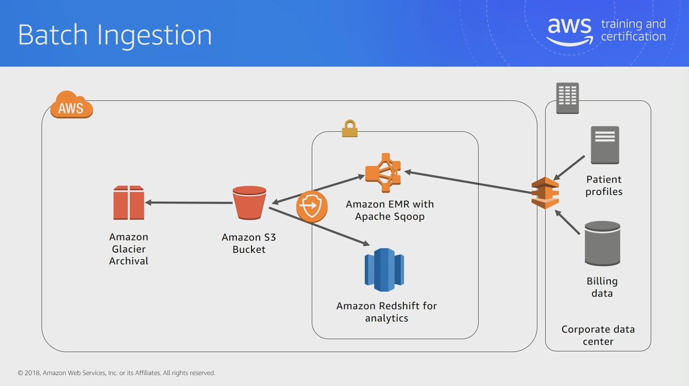
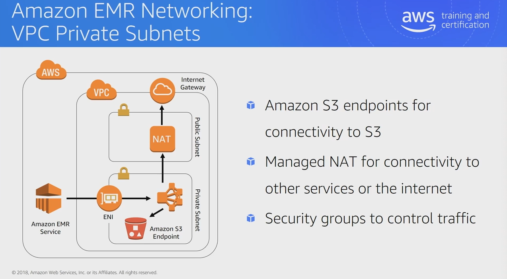
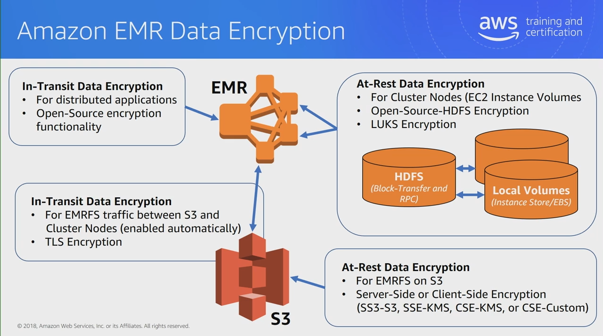
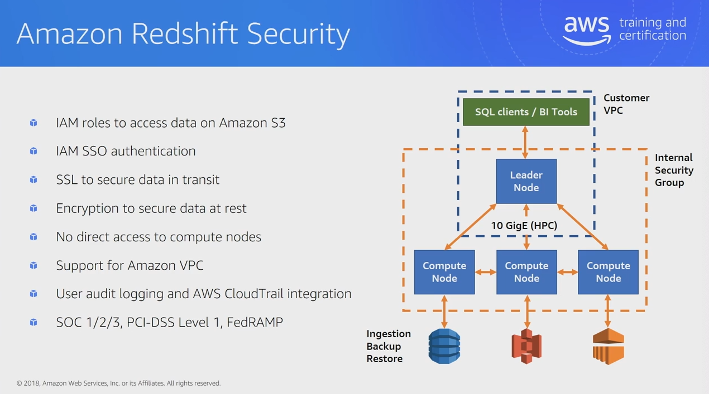
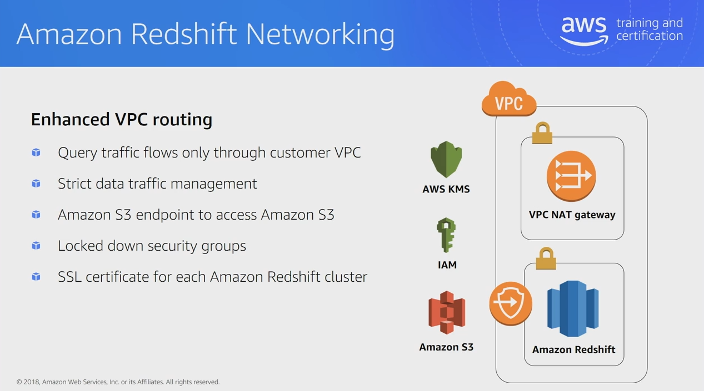

* Big data envolving from batch processing to real-time processing, prediction
and AI
* The core of big data is to: store, analyse, predict
* For the exam you are expected to know some ML (machine learning) and DL (deep learning) algorithms
* The technologies you choose are often dictated by the time to answer (latency)
  * Based on that information you can choose the right and most cost-effective
solution for your pipeline

* A big data processing system looks like a large pipe
  * Data comes on one side and answers coming out on another side

* You shape the data in the store/process/analyse steps into whatever compatible
the downstream systems you have

* **Important:** the technologies you choose are often dictated by the latency
of the pipe or the time needed to answer the throughput of that pipe. This is
composed of the number of requests per second and the payload size costs and of
course security

* For the exam:
  * when you see anything mentioned about ease of use, timeliness or
cost-efficiency think about using managed services or serverless services

### Imporoving Train Safety with AWS IoT

* Scenario: You are the lead architect for a new connected train. The CEO of
your company is convinced taht your trains should collect as much data as
possible so that it can be used for predictive maintenance and to improve safety

* Questions:
  1. How would you **collect the data** that the trains are generating?
  2. Your CEO has asked you to design a **low-cost** system that will **let the
     train know** whether it finds any **anomalies in the data** it collects. How would this best be accomplished?
  3. How would you **share the collected sensor data** with your team of **train
     engineers** and **data scientists**?

* Trains needs to pass through tunnels without network connection
  * IoT core helps to collect the data
  * The train when is not reachable, you can send a message to device shadow and
the information from the device shadow will be sent to the train. When train
connects it will receive the latest information

* Detecting Anomalies with RANDOM_CUT_FOREST

* How many input streams can you have in an Kinesis Analytics application? You
can have only 1 stream per Kinesis Data Analytics app

* Real-time view onti results of your anomalies detection. How to provide that?
  * You need to build your own aws lambda function to put data into AWS Elastic
Search Cluster
  * You can't use Firehose because minimum collection interval is 60s
(near-real-time

* How to share the informaiton to train engineers and data scientists
  * Data scientists need access to raw sensor data - S3
  * Enginerrs need access to processed data - Redshift
  * Business users need access to a few simple interaction reports - QuickSight

* IoT rule to Kinesis Data Firehose to get the raw data into S3

### Sensor Data Disaster Recovery
* Consider using cross-region replication for extra reliability
* Create a lifecycle policy
* Use Glacier for data affordable archiving and long-term backup

### Sharing the Sensor data on S3
  * Encrypt data at rest:
    * Client-side encryption
    * Server-side encryption (client keys)
    * Server-side encryption (KMS)
  * Protect bucket contents
    * IAM policies
    * Bucket policies
  * Audit access
    * AWS CloudTrail

### Sharing Procesed Data on Redshift
  * Cluster
    * Is in VPC and a private subnet
    * Can be accessed via Direct Connect
    * Is encrypted with KMS / CloudHSM
    * Obtain data in S3 through an S3 endpoint
  * Access
    * Restricted by a security group
    * Clients use TLS
    * Access via user name and password for SSO from your idP
  * Setup
    * A nonstandard port
    * Cloudwatch alarms

* The resources you want to visualize with QuickSight the resources has to be in the same region

* S3DistCp (s3-dist-cp): Apache DistCp is an open source tool you can use to
 copy large amoutn of data. S3DistCp is an extention of DistCp that is optimized to work with AWS. Using S3DistCp, you can efficiently copy large amounts of data from S3 into HDFS where it can be processed by subsequent steps in your EMR cluster

### Compliance for Healthcare

* Scenario: A healthcare facility wants to **collect patien data** about diagnostic
 codes, vital signs, tests and their results, and sensor data from devices such
 as pacemakers, blood pressure monitors, and hear rate monitors. The facility
 wants to aggregate a **snapshot of patient profiles** and **cross-reference mediacal
 data with billing data.** Your solution must incorporate **HIPAA complience**

* Possible Questions:
  * How to you decouple protected data from processind and orchestration
  * How do you automate the tracking of data flow?
  * What logical boundaries can be implemented between protected and general
workflows?

* Medical devices send data to a trusted proxy and pushing the data using AWS
Kinesis Data streams. This means using MQTT topics, creating IoT AWS rules and
IAM permissions
  *  To read from or write to encrypted stream producer and consumer
applications must have permission to access the master key

* Apache Sqoop on EMR can be used to ingest data from on-premises databases

* Launching a cluster into VPC is similar to launching a cluster into private
network, with additional tools to define who has access to that network
* You can launch EMR in both public and private VPC, you need to connect to
services outside of the VPC

* Amazon EMR and Kerberos
  * Kerberos is an user authentication framework that can integrate with IAM
  * Amazon EMR 5.10.0 and later supports Kerberos
  * Services and users that authenticate are called pricipals
  * Principals exist in a Kerberos realm
  * The key distribution center (KDC) managed authnetication
  * The KDC issues tickets
  * Principals can be from other Realms. This requires Cross-Realm-Trust

* Four features of Hive that are specific to EMR
  * Load table partitions automatically from S3
  * Specify an off-instance metadata store
  * Write data directly to S3
  * Access resources located in S3

* Ranger is a row-based access control framework to enable monitoring and manage
comprehensive data security across the hadoop platform

* Redshift Security

* Copy and Unload commands will be forced to rout traffic through VPC

