* Big data envolving from batch processing to real-time processing, prediction
and AI
* The core of big data is to: store, analyse, predict
* For the exam you are expected to know some ML (machine learning) and DL (deep learning) algorithms
* The technologies you choose are often dictated by the time to answer (latency)
  * Based on that information you can choose the right and most cost-effective
solution for your pipeline

* A big data processing system looks like a large pipe
  * Data comes on one side and answers coming out on another side

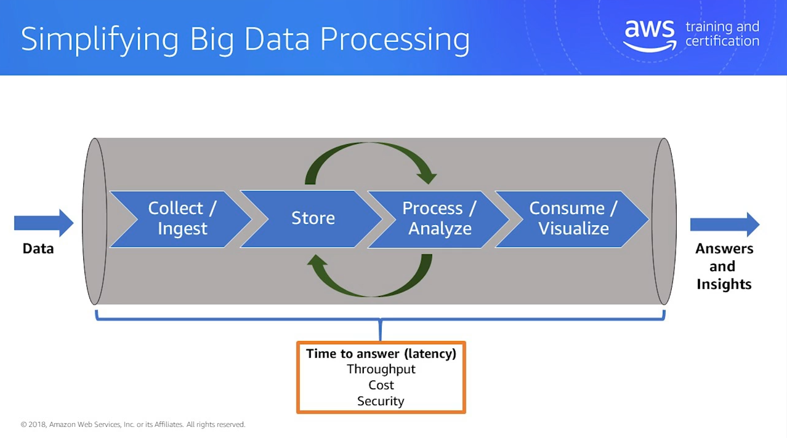

* You shape the data in the store/process/analyse steps into whatever compatible
the downstream systems you have

* **Important:** the technologies you choose are often dictated by the latency
of the pipe or the time needed to answer the throughput of that pipe. This is
composed of the number of requests per second and the payload size costs and of
course security

* For the exam:
  * when you see anything mentioned about ease of use, timeliness or
cost-efficiency think about using managed services or serverless services

### Imporoving Train Safety with AWS IoT

* Scenario: You are the lead architect for a new connected train. The CEO of
your company is convinced taht your trains should collect as much data as
possible so that it can be used for predictive maintenance and to improve safety

* Questions:
  1. How would you **collect the data** that the trains are generating?
  2. Your CEO has asked you to design a **low-cost** system that will **let the
     train know** whether it finds any **anomalies in the data** it collects. How would this best be accomplished?
  3. How would you **share the collected sensor data** with your team of **train
     engineers** and **data scientists**?

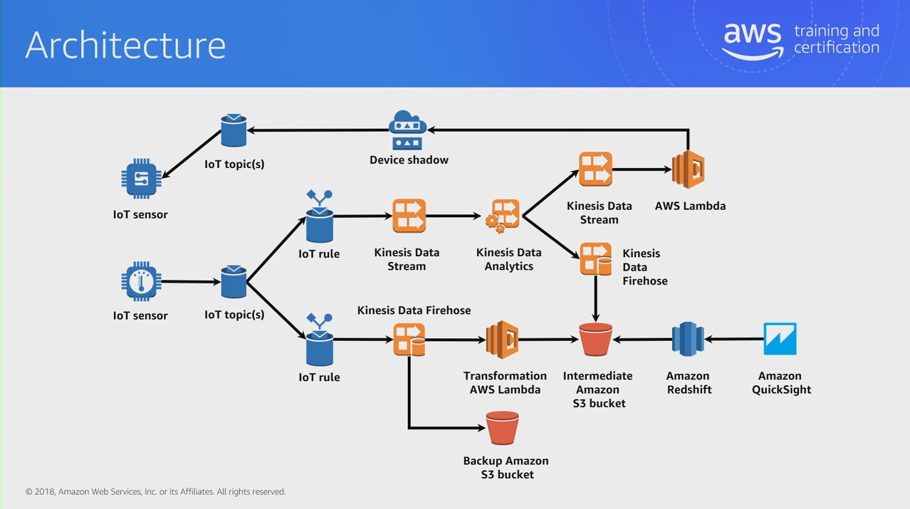

* Trains needs to pass through tunnels without network connection
  * IoT core helps to collect the data
  * The train when is not reachable, you can send a message to device shadow and
the information from the device shadow will be sent to the train. When train
connects it will receive the latest information

* Detecting Anomalies with RANDOM_CUT_FOREST

* How many input streams can you have in an Kinesis Analytics application? You
can have only 1 stream per Kinesis Data Analytics app

* Real-time view onti results of your anomalies detection. How to provide that?
  * You need to build your own aws lambda function to put data into AWS Elastic
Search Cluster
  * You can't use Firehose because minimum collection interval is 60s
(near-real-time

* How to share the informaiton to train engineers and data scientists
  * Data scientists need access to raw sensor data - S3
  * Enginerrs need access to processed data - Redshift
  * Business users need access to a few simple interaction reports - QuickSight

* IoT rule to Kinesis Data Firehose to get the raw data into S3

### Sensor Data Disaster Recovery
* Consider using cross-region replication for extra reliability
* Create a lifecycle policy
* Use Glacier for data affordable archiving and long-term backup

### Sharing the Sensor data on S3
  * Encrypt data at rest:
    * Client-side encryption
    * Server-side encryption (client keys)
    * Server-side encryption (KMS)
  * Protect bucket contents
    * IAM policies
    * Bucket policies
  * Audit access
    * AWS CloudTrail

### Sharing Procesed Data on Redshift
  * Cluster
    * Is in VPC and a private subnet
    * Can be accessed via Direct Connect
    * Is encrypted with KMS / CloudHSM
    * Obtain data in S3 through an S3 endpoint
  * Access
    * Restricted by a security group
    * Clients use TLS
    * Access via user name and password for SSO from your idP
  * Setup
    * A nonstandard port
    * Cloudwatch alarms

* The resources you want to visualize with QuickSight the resources has to be in the same region

* S3DistCp (s3-dist-cp): Apache DistCp is an open source tool you can use to
 copy large amoutn of data. S3DistCp is an extention of DistCp that is optimized to work with AWS. Using S3DistCp, you can efficiently copy large amounts of data from S3 into HDFS where it can be processed by subsequent steps in your EMR cluster

### Compliance for Healthcare

* Scenario: A healthcare facility wants to **collect patien data** about diagnostic
 codes, vital signs, tests and their results, and sensor data from devices such
 as pacemakers, blood pressure monitors, and hear rate monitors. The facility
 wants to aggregate a **snapshot of patient profiles** and **cross-reference mediacal
 data with billing data.** Your solution must incorporate **HIPAA complience**

* Possible Questions:
  * How to you decouple protected data from processind and orchestration
  * How do you automate the tracking of data flow?
  * What logical boundaries can be implemented between protected and general
workflows?

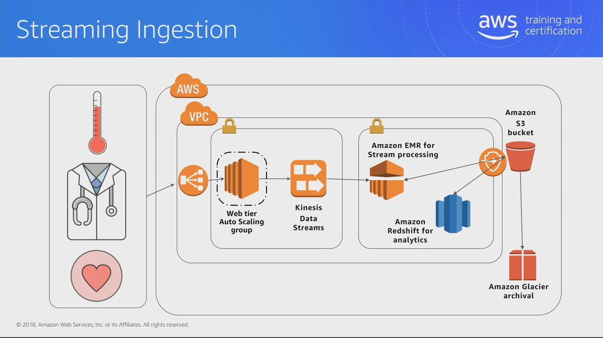

* Medical devices send data to a trusted proxy and pushing the data using AWS
Kinesis Data streams. This means using MQTT topics, creating IoT AWS rules and
IAM permissions
  *  To read from or write to encrypted stream producer and consumer
applications must have permission to access the master key

* Apache Sqoop on EMR can be used to ingest data from on-premises databases

* Launching a cluster into VPC is similar to launching a cluster into private
network, with additional tools to define who has access to that network
* You can launch EMR in both public and private VPC, you need to connect to
services outside of the VPC

* Amazon EMR and Kerberos
  * Kerberos is an user authentication framework that can integrate with IAM
  * Amazon EMR 5.10.0 and later supports Kerberos
  * Services and users that authenticate are called pricipals
  * Principals exist in a Kerberos realm
  * The key distribution center (KDC) managed authnetication
  * The KDC issues tickets
  * Principals can be from other Realms. This requires Cross-Realm-Trust

* Four features of Hive that are specific to EMR
  * Load table partitions automatically from S3
  * Specify an off-instance metadata store
  * Write data directly to S3
  * Access resources located in S3

* Ranger is a row-based access control framework to enable monitoring and manage
comprehensive data security across the hadoop platform

* Redshift Security

* Copy and Unload commands will be forced to rout traffic through VPC

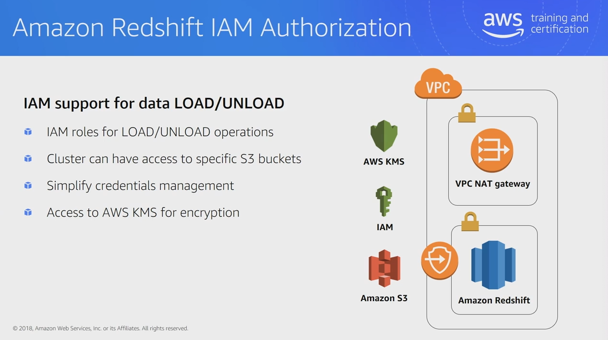

* Sample Question #1
  * You have close to 10 PB data in your data centers and are planning to use
Snowball to move 6 PB data to AWS in the next few months. This data will be
stored in S3 and will be used to implement the data lake architecture that your
company envisions. **EMR will be used to process this data** and you have
dtermined that the **average file size should be 10GB after compression**. To
help with costs and to **save network bandwidth**, which would be the best
compression algorithm to use? - gzip is not corret it does not support file
splitting. snappy is not corrent because it also doesn't support file splitting,
avro is not correct because avro is about data serialization. bzip2 is correct
because it meets all the requirements

### Social Media Mobile App
* Scenario: You company has developed a **popular** mobile app that offers
coupons for registered local businesses within the user's vicinity. Discounts
are **valid only for a limited time**. Users of this app can rate the coupon and
provide comments. The application then aggregates this feedback alsong with
usage data for each business. A **major sporting event** is coming to the
downtown area, and you need to ensure that the service can **scale** in an
**cost-efficient** manner to deal with the **increased volume** in traffic
during the event
  * Possible questions:
    * Ensure that service will scale in a cost-efficient manner?
    * Prevent throttling?
    * Collect data (such as user feedback and app usage) in real time?
    * Le the local businesses view the feedback and usage data?

* You can use timestamp as a sort key to retrieve data by days from start to the
end

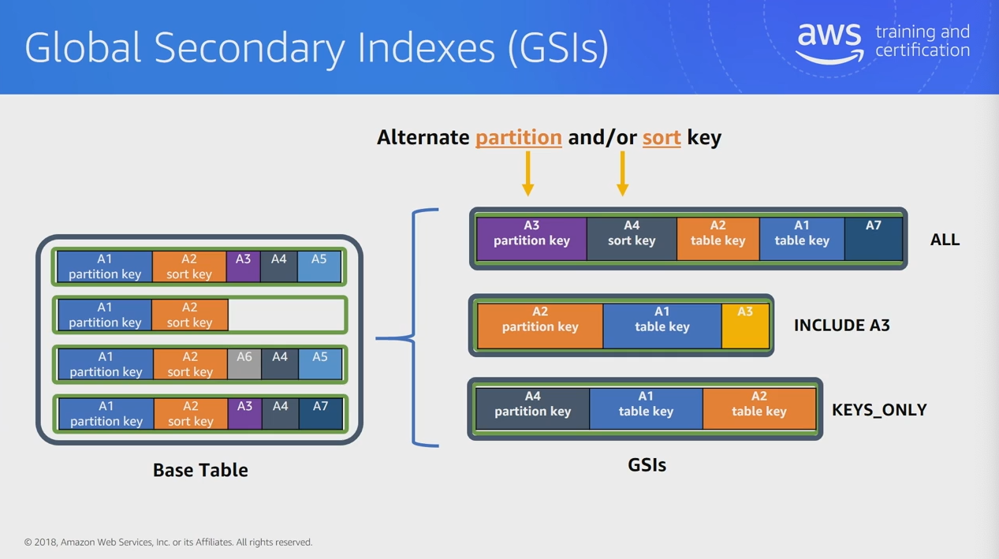

* When to use GSI vs. LSI
  * Large scale integration can be modelled as a GSI
  * If the datasize of an item collection is greater than 10GB, use GSI
  * If eventuall consistency is okay, use global secondary index
  * If you want to query a talbe on a non-key attribute use GSI
* As the table grows the scan operation slows. For faster response times design
your app to use query instead of scan

* Preventing throttling
  * 1 RCU 4kb (strong consistency) or 1 RCU 8kb (eventuall consistency)

* Randomize partition keys to split the data evenly between partitions

* What is the max. throughput you can provision on a table? There is no
theoretical limit. You can alaways add more partitions infinitely

* What is consistency model for DAX? Eventually consistent reads. You can
provision multiple DAX clusters for the same dynamodb table, these clusters can
provide different endpoints to solve different scenario

* Kinesis data streams for custom processing and realtime data
* Kinesis Firehose is for data delivery into the target

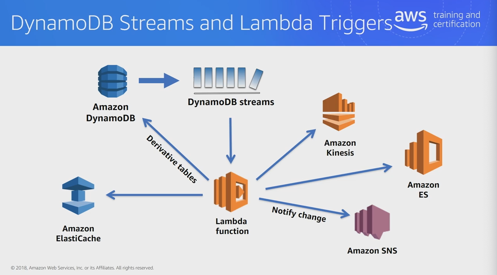

* Preexisting data will not be incrypted?
* Dynamodb global table to replicate your tables automatically across the
regions you want to

* How much data can you analyze with QuickSight? No need to worry about it
* You can connect QuickSight to EC2 or on-premises database, you need to add
Quicksight IP range to authorized list (whitelist) in your hosted database.

### Clickstream Analysis
* Your company serves **media content** to affiliate websites and mobile apps. How
would you build a system to help your company's **analysts** optimize served
content?

* We know who is viewing our content through cookies
* We have also a certain amount of information about affiliate websites
* Combining this two pieces of information

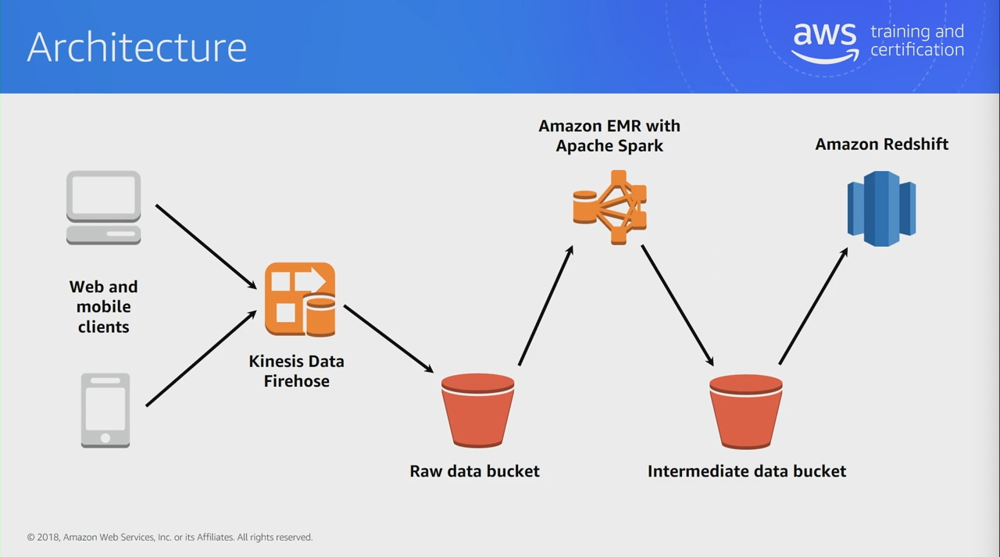

* If you ask the analysist about how fast they want to get the reporting result.
They probably would say as quick as possible. By quickly they mean in real-time.
But does real-time actually mean?

* Realtime systems are expensive and more difficult.
* It is important to consider characteristics of the system you are building
* You need to know how you are going to ingest data 
  * Real-time
  * Micro batch
  * Batching

* Here we make a decision to use micro batching, getting results to an analyst
in half an hour is acceptable

* Collection mechanism: easy to deploy across many websites

* Data can be transformed (lambda), encrypted (KMS), compressed (gzip)

* Source data from one bucket -> EMR ---> put the data into another bucket
processed data

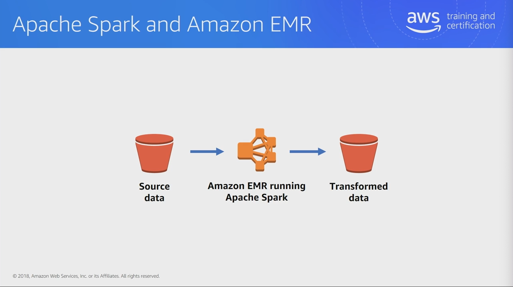

* Spark SQL can read from Hive
* Spark Streaming can read from Kinesis

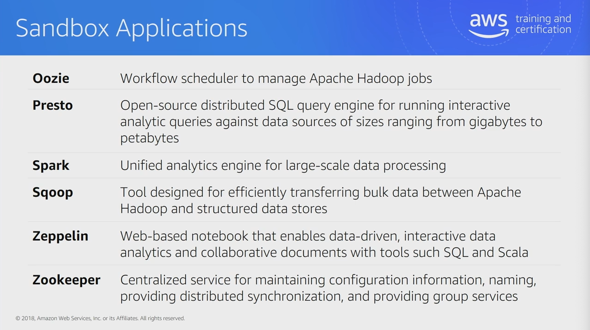

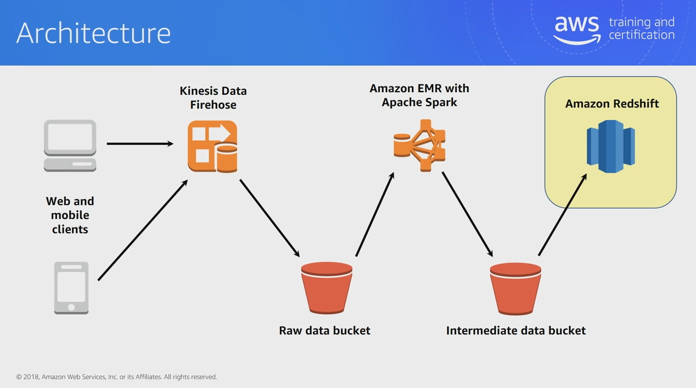

* Columnar data is stored sequentially in the storage
* On one block of the disk is all data you need, there are also values such as
max/min on one block
* Redshift is mpp (massive parallel processing system)
  * Each slice is an independend partition of data and they work in parallel to
speed up the execution

* Distribution styles:
  * Even: Distribute the rows across the slices in a round-robin fashion (default)
    * Appropriate when a talbe does not participate in joins or where is not
clear if to use key or all distribution
  * Key: Distribute according to the values in one column
    * The leader node will place the matching values on the same node slice 
    * If you distribute a pair of table on the joining keys, the leader node
will co-locate the rows to the slices according to the values in the joining
values
  * All: Distribute the entire table to every node
    * Every row is co-located for every join that a table participates in
    * It takes much longer to load and upsert data
    * Only for slow-moving tables, that are not updated frequently

* One important aspect to speed up Redshift is to use sort key
  * When you create a table you define one or more of it's columns as it's sort
keys
  * When data is initially loaded into an empty table, the rows are stored on
disk in sorted order. Information about the sort key columns is passed to the
query planner and a planner uses this information to construct plans that
exploit the ways that a data is sorted
  * You can specify either a compound or interleaved sort key 
  * A compound sort key is more efficient when a query predicates use a prefix
  * Interleaved can give equal weigth

* Redshift stores data in blocks, each block is marked with a metadata that
includes the max and min values for the sort key. For example when you must a
run a query in an unsorted table, you must look into 4 out of 5 blocks, to get
the result. In a sorted table you look only in 1 block 

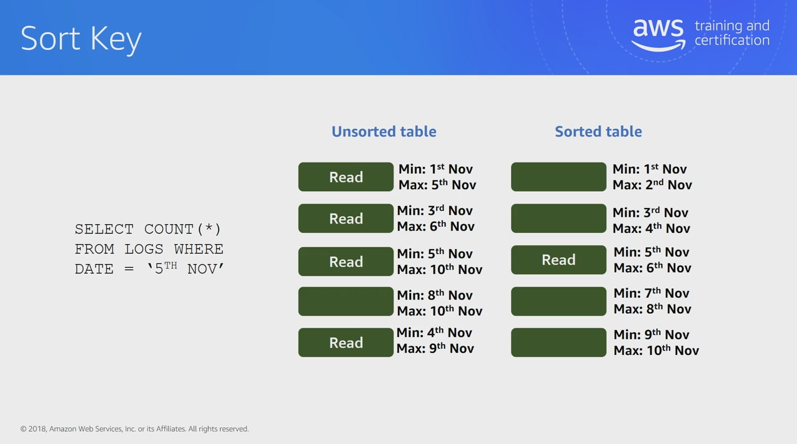

* You can define of max 8 queues (max. queries are 50)
* You can define the groups based on the importance of the group

### Fraud Detection
* Every day in a **large global** consulting comapny, all employees enter their
timesheets into an online system that stores the data on-premises in a
transactional database. At regular intervals during the day, **a batch ETL job
loads the data into a data warehouse** to report on financials. You CFO is
concerned about **potential incidents** of timesheets fraud and is interested in
using machine learning to identify suspect timesheets in a timely manner.
  * Questions:
    1. How can you feed large volumes of data into your machine learning model
       for generating predictions?
    2. How can you analyze the data and build visualization and/or reports?

