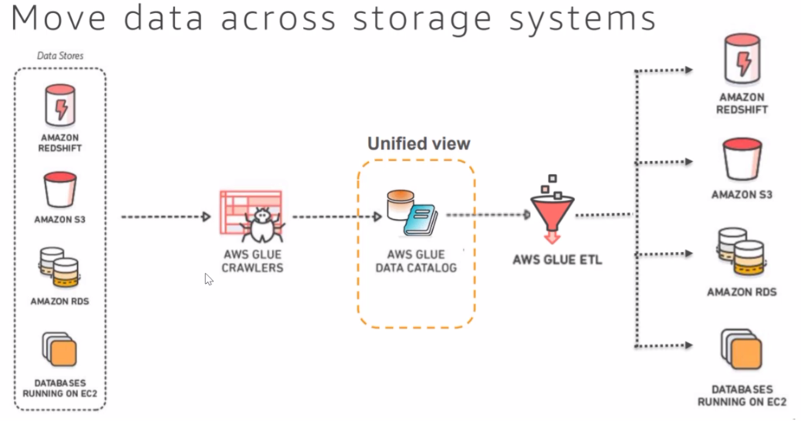

# AWS Glue

### Architecture

* ETL is the most time-consuming part of analytics
* ETL 80% of time spent here. Because the data is not in the right schema, it
  needs to be cleansed etc. before it goes into Data Warehousing.
* ETL is an acronym that stands for for moving data from one source to another
  destination
* When you move the data to S3, you have 3 components until you get the Business
  Insights:
    * ETL 80% of time
    * Data warehousing - Redshift (can plug also Athena but only works on S3,
      but can also be used with Spectrum)
    * Visualizaiton / Insights - QuickSight
* What is Glue?
  * Discover: Automatically discover and categorize your data
    * Hive metastore compatible
    * Automatic crawling
  * Develop: Generate code to clean, enrich, and reliably move data between
    various data sources
      * Auto-generates ETL code
      * Python and Apache / Scala
      * Spark
      * Edit
  * Deploy: Run your jobs on a serverless, fully-managed, scale-out
    (horizontally) environment
      * Serverless execution
      * Flexible scheduling

* You can use Athena Catalog, but the preferred medium is the Glue Data Catalog
* Glue Catalog is just a schema definition, the data lies in S3
* Glue ETL jobs will read the catalog and move the data to S3, Redshift, RDS,
  Databases running on EC2 
* Glue ETL in general can transform the data in S3, before you run crawlers to
  discover the data
* Unstructured data is stored in S3, Glue ETL transforms the data, Glue Crawlers
  will discover the data and store the metadata will be stored in Data Catalog.
  Tools such as Athena, Spectrum, EMR will query the data.
* Developers can create algorithms live via a Zeppelin Notebooks and query the
  data live. Those algorithms can be run periodically on Glue ETL.
* Once the data is in Athena, you can visualize that data in QuickSights

### Terminology
* Glue Data Catalog:
  * The persistent metadata store in AWS Glue. Each AWS account has one AWS Glue
    Data Catalog. 
  * Using the metadata in the Data Catalog, AWS glue can autogenerate Scala or
    PySpark scripts with AWS Glue extentions that you can use and modify to
    perform various ETL operations
  * It is managed service that lets you store, annotate, and share metadata in
    the AWS Cloud in the same way you would in an Apache Hive metastore. It
    provides a uniform repository where disparate systems can store and find
    metadata to keep track of data in data silos, and use that metadata to query
    and transform the data
  * Data Catalog can be versioned
* Table: 
  * A table in the AWS Glue Data Catalog consists of the names of columns, data
    type defintions, and other metadata about a base dataset. The schema of your
    data is represented in your AWS Glue Table defintion. The actual data
    reamins in its original data store, whether it be in a file or a relational
    database table.
  * Table is similar to Tables in DynamoDB, Redshift, RDS
  * A table is a collection of items, and each item is a collection of
    attributes
  * A table is a data structure that is composed of other data types
* Classifier:
  * Determine the schema of your data. AWS Glue provides classifiers for common
    file types, such as CSV, JSON, AVRO, XML and other. You can write your own
    classifierts too.
  * This is also called SCHEMA ON READ.
* Crawler: 
  * A program that connects to a data store (source or target), progresses
    through a prioritized list of classifierts to termine the schema for your
    data, and then creates metadata in the AWS Glue Data Catalog
  * AWS Glue also lets you set up crawlers that can scan data in all kinds of
    repositiers, classify it, extract schema information from it, and store the
    metadata automatically in the Data Catalog. From there it can be used to
    guide ETL operations.
* Connection:
  * Contains the properties that are required to connect to your data store
* Script:
  * Code that extracts data from sources, transfroms it, and loads it into
    targets. AWS Glue generates PySpark or Scala scripts. PySpark is a Pythong
    dialect for ETL programming.
  * Reads the Data Catalog and extracts / loads the data for transformation
* Transform
  * The code logic that is used to maniputate your data into a different format
    / enrich. 
* Job:
  * The business logic that is required to perform ETL work. It is composed of a
    transformation script, data sources, and data tagets. Job runs are initiated
    by triggers that can be scheduled or triggered by events.
* Trigger - Initiates an ETL job. Triggers can be defined based on a scheduled
  time or an event.
* Develpment endpoint - An environment that you can use to develop and test your
  AWS Glue scripts.

### Application of AWS Glue
* You can use AWS Glue to build a data warehouse to roganize, cleanse, validate,
  and format data
* Discovers and catalogs metadata about your data stores into a central catalog.
* Populates the Data Catalog iwth table definitions from scheduled crawler
  programs
* Crawlers call classifier logic to infer the schema, format and data types of
  your data. This metadata is stored as tables in teh AWS Glue Data Catalog and
  used in the authoring process of your ETL jobs
* Generates ETL scripts to transform, flatten, and enrich your data from source
  to target
* Detects schema changes and adapts based on your preferences.
* Triggers your ETL jobs based on a schedule or event. You can initate jobs
  automatically to move your data into your data warehouse. Triggers can be used
  to create a dependency flow between jobs
* Gathers runtime metrics to monitor the activities of your data warehouse
* Handles errors and retrieves automatically
* Scales resources as, needed, to run your jobs
